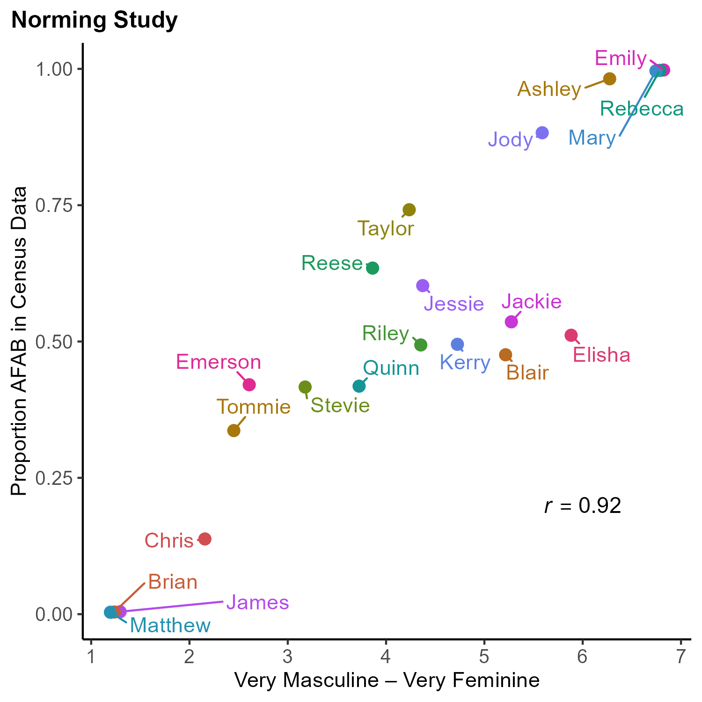

```{r setup, include=FALSE}
library(tidyr)
library(dplyr)
library(magrittr)
library(stringr)
library(ggplot2)
library(ggrepel)
library(knitr)
```

For the norming study, 51 participants on MTurk rated 92 first names on
a scale from 1 being "very masculine" to 7 being "very feminine." The
masculine and feminine names were selected from the top 100 names
according to US census data:

> United States Social Security Administration. (2019). *Top names over
> the last 100 years* [Data Set]. United States Social Security
> Administration.
> <https://www.ssa.gov/oact/babynames/decades/century.html>

The androgynous names were selected from a list of names that were given
at least one-third of the time to AFAB children in the US and also at
least one-third of the time to AMAB children.

> Flowers, A. (2015). *Unisex names data* [Data Set]. FiveThirtyEight.
> <https://github.com/fivethirtyeight/data/tree/master/unisex-names>

```{r load-data}
all_ratings <- read.csv("../data/exp0_data_norming.csv",
                        stringsAsFactors = TRUE) %>%
  select(-gender) %>%
  # pivot to have one row per name, not one column per name
  pivot_longer(
    cols      = c(-ResponseId),
    names_to  = "Name",
    values_to = "GenderRating"
  )
```

Mean and SD of gender ratings for each name, sorted from most feminine
to most masculine.

```{r mean-ratings}
mean_ratings <- all_ratings %>%
  group_by(Name) %>%
  summarise(
    MeanGenderRating = mean(GenderRating),
    SD = sd(GenderRating)
  ) %>%
  arrange(desc(MeanGenderRating))

kable(mean_ratings)
```

Selected 21 names from these results, with 3 names around each of the 7
intervals.

```{r select-names}
names_used <- mean_ratings %>%
  filter(str_detect(
    Name,
    paste(sep = "", 
      "Matthew|Brian|James|Chris|Tommie|Emerson|Stevie|Quinn|Reese|",
      "Taylor|Riley|Jessie|Kerry|Blair|Jackie|Jody|Elisha|Ashley|Mary|",
      "Rebecca|Emily"
    )
  )) %>%
  filter(Name != "Christopher")

kable(names_used, digits = 2)
```

To check to see if the norming data were biased to call names more
masculine, I compared them to the US census data for gender assigned at
birth.

> United States Social Security Administration. (2020). *Beyond the top
> 1000 names* [Data Set]. United States Social Security Administration.
> <https://www.ssa.gov/oact/babynames/limits.html>

```{r census-data}
census <- read.csv("../data/exp0_data_census.csv")

names_used <- left_join(names_used, census, by = "Name")
```

Calculate the correlation:

```{r correlations}
cor.test(names_used$MeanGenderRating, names_used$Census_ProbFemale)
```

A few of the androgynous names have bigger discrepancies, likely because
their gender associations have been changing over time. Overall, though,
the mean difference is close to 0, and not all of the differences
involve the norming data over-estimating the masculinity of a name.

And visualize it:

