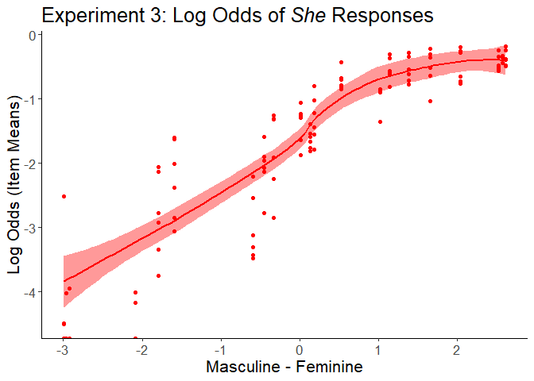

Experiment 3: Supplementary Analyses
================
2023-02-07

- <a href="#setup" id="toc-setup">Setup</a>
- <a href="#quadratic-name-gender-rating"
  id="toc-quadratic-name-gender-rating">Quadratic Name Gender Rating</a>
  - <a href="#model" id="toc-model">Model</a>
  - <a href="#main-quadratic-effect" id="toc-main-quadratic-effect">Main
    quadratic effect</a>
  - <a href="#quadratic-interaction"
    id="toc-quadratic-interaction">Quadratic interaction</a>
- <a href="#participant-gender" id="toc-participant-gender">Participant
  Gender</a>
  - <a href="#setupdata-summary" id="toc-setupdata-summary">Setup/Data
    Summary</a>
  - <a href="#model-1" id="toc-model-1">Model</a>
- <a href="#gender-rating-centering"
  id="toc-gender-rating-centering">Gender Rating Centering</a>
  - <a href="#model-6-gender-rating-recentered"
    id="toc-model-6-gender-rating-recentered">Model 6: Gender Rating
    Recentered</a>

# Setup

Variable names:

- Experiment: exp3
- Type
  - d = data
  - m = model
  - p = plot
  - est = log odds estimate from model
  - OR = odds ratio converted from est
- Analysis
  - quad = quadratic effect of Name Gender
  - gender = participant gender
  - recentered = center name gender rating by scale (at 4)
- Subset
  - FF = First and Full Name conditions only


Load data and select columns used in model. See data/exp3_data_about.txt
for more details.

``` r
exp3_d <- read.csv("../data/exp3_data.csv", stringsAsFactors=TRUE) %>%
  rename("Participant"="SubjID", "Item"="Name") %>%
  select(Participant, SubjGenderMale, Condition, 
         GenderRating, Item, He, She, Other)

str(exp3_d)
```

    ## 'data.frame':    8904 obs. of  8 variables:
    ##  $ Participant   : Factor w/ 1272 levels "Exp3_P1","Exp3_P10",..: 974 974 974 974 974 974 974 330 330 330 ...
    ##  $ SubjGenderMale: int  1 1 1 1 1 1 1 0 0 0 ...
    ##  $ Condition     : Factor w/ 3 levels "first","full",..: 1 1 1 1 1 1 1 1 1 1 ...
    ##  $ GenderRating  : num  5.22 1.24 5.86 3.75 6.78 4.34 2.41 6.24 2.61 6.82 ...
    ##  $ Item          : Factor w/ 63 levels "Ashley Cook",..: 6 9 13 43 47 52 62 2 16 20 ...
    ##  $ He            : int  0 1 0 0 0 0 1 0 1 0 ...
    ##  $ She           : int  0 0 1 0 1 1 0 0 0 1 ...
    ##  $ Other         : int  1 0 0 1 0 0 0 1 0 0 ...

Center gender rating for names: Original scale from 1 to 7, with 1 as
most masculine and 7 as most feminine. Mean-centered with higher still
as more feminine.

``` r
exp3_d %<>% mutate(GenderRatingCentered=
            scale(GenderRating, scale=FALSE))
```

Set contrasts for name conditions. This uses Scott Fraundorf’s function
for weighted contrasts. (The psycholing package version doesn’t support
doing 2v1 comparisons, only 1v1.) Condition1 is Last vs First+Full.
Condition2 is First vs Full.

``` r
source("centerfactor.R") 
contrasts(exp3_d$Condition) <- centerfactor(
  exp3_d$Condition, c("last","first"))
contrasts(exp3_d$Condition)
```

    ##             [,1]        [,2]
    ## first  0.4009434 -0.48113208
    ## full   0.4009434  0.51886792
    ## last  -0.5990566  0.01886792

# Quadratic Name Gender Rating

The second supplementary analysis tested the quadratic effect of name
gender rating, such that larger values meant names with stronger gender
associations (masc or fem), and smaller values meant names with weaker
gender associations.

``` r
exp3_d %<>% mutate(GenderRatingSquared=GenderRatingCentered^2)
```

## Model

Quadratic name gender effect on the likelihood of *she* responses, as
opposed to *he* and *other* responses. The maximal model includes random
intercepts by item, but not by participant.

``` r
exp3_m_quad <- buildmer(
  She ~ Condition*GenderRatingCentered + Condition*GenderRatingSquared +
    (1|Participant) + (1|Item), 
  data = exp3_d, family = binomial,
  buildmerControl(direction = "order", quiet = TRUE))
summary(exp3_m_quad)
```

    ## Generalized linear mixed model fit by maximum likelihood (Laplace
    ##   Approximation) (p-values based on Wald z-scores) [glmerMod]
    ##  Family: binomial  ( logit )
    ## Formula: She ~ 1 + GenderRatingCentered + GenderRatingSquared + Condition +  
    ##     GenderRatingCentered:Condition + GenderRatingSquared:Condition +  
    ##     (1 | Item)
    ##    Data: exp3_d
    ## 
    ##      AIC      BIC   logLik deviance df.resid 
    ##   7979.5   8050.4  -3979.7   7959.5     8894 
    ## 
    ## Scaled residuals: 
    ##     Min      1Q  Median      3Q     Max 
    ## -2.1120 -0.5443 -0.1467  0.6532 15.2267 
    ## 
    ## Random effects:
    ##  Groups Name        Variance Std.Dev.
    ##  Item   (Intercept) 0.3002   0.5479  
    ## Number of obs: 8904, groups:  Item, 63
    ## 
    ## Fixed effects:
    ##                                 Estimate Std. Error  z value Pr(>|z|) Pr(>|t|)
    ## (Intercept)                     -1.09643    0.11101 -9.87643    0.000  < 2e-16
    ## GenderRatingCentered             1.06982    0.05554 19.26236    0.000  < 2e-16
    ## GenderRatingSquared             -0.11378    0.03102 -3.66732    0.000 0.000245
    ## Condition1                       0.23784    0.07935  2.99748    0.003 0.002722
    ## Condition2                       0.05570    0.09965  0.55893    0.576 0.576208
    ## GenderRatingCentered:Condition1  0.22179    0.06115  3.62713    0.000 0.000287
    ## GenderRatingCentered:Condition2 -0.11288    0.08816 -1.28044    0.200 0.200391
    ## GenderRatingSquared:Condition1  -0.09635    0.02976 -3.23767    0.001 0.001205
    ## GenderRatingSquared:Condition2   0.03866    0.04184  0.92410    0.355 0.355432
    ##                                    
    ## (Intercept)                     ***
    ## GenderRatingCentered            ***
    ## GenderRatingSquared             ***
    ## Condition1                      ** 
    ## Condition2                         
    ## GenderRatingCentered:Condition1 ***
    ## GenderRatingCentered:Condition2    
    ## GenderRatingSquared:Condition1  ** 
    ## GenderRatingSquared:Condition2     
    ## ---
    ## Signif. codes:  0 '***' 0.001 '**' 0.01 '*' 0.05 '.' 0.1 ' ' 1
    ## 
    ## Correlation of Fixed Effects:
    ##             (Intr) GndrRC GndrRS Cndtn1 Cndtn2 GRC:C1 GRC:C2 GRS:C1
    ## GndrRtngCnt -0.093                                                 
    ## GndrRtngSqr -0.638 -0.252                                          
    ## Condition1  -0.005 -0.007  0.007                                   
    ## Condition2  -0.007  0.014 -0.005  0.029                            
    ## GndrRtnC:C1  0.021  0.212 -0.189 -0.143  0.018                     
    ## GndrRtnC:C2  0.001 -0.099  0.078  0.018 -0.146 -0.090              
    ## GndrRtnS:C1 -0.018 -0.191  0.175 -0.424 -0.032 -0.657  0.078       
    ## GndrRtnS:C2  0.003  0.086 -0.073 -0.031 -0.361  0.081 -0.723 -0.053

## Main quadratic effect

To make this easier to understand, plot the data converted to log odds.
This includes just what the model is testing: *she* responses, no
effects of Condition included yet.

``` r
exp3_d_log <- exp3_d %>% 
  group_by(Condition, GenderRating) %>%
  summarise(He.Mean=mean(He),
            She.Mean=mean(She),
            Other.Mean=mean(Other)) %>%
  mutate(He.Log=log(He.Mean),
         She.Log=log(She.Mean),
         Other.Log=log(Other.Mean)) %>%
  mutate(Condition_Model=case_when(
    Condition=="first" ~ "First + Full",
    Condition=="full" ~ "First + Full",
    Condition=="last" ~ "Last"))
```

``` r
exp3_p_log <- ggplot(exp3_d_log, 
  aes(x=GenderRating)) +
  geom_smooth(aes(y=She.Log), fill="red", color ="red") +
  geom_point(aes(y=She.Log), fill="red", color ="red") +
  geom_vline(xintercept=4) +
  theme_classic() +
  labs(title="Experiment 3: Log Odds of *She* Responses", 
       x="Masculine - Feminine", 
       y="Log Odds") +
  theme(text=element_text(size=16),
        plot.title=element_markdown()) 
exp3_p_log
```

    ## `geom_smooth()` using method = 'loess' and formula = 'y ~ x'

<!-- -->

At the masculine end of the scale, *she* responses decrease more
linearly. At the feminine end of the scale, *she* responses level off at
around 5.5 (mostly feminine), then don’t ever reach 0. Fewer *she*
responses in 6-7 range than *he* responses in 1-2 range.

## Quadratic interaction

Now, plot the comparison for the Last vs First+Full condition
interaction.

``` r
exp3_p_quadCond <- ggplot(exp3_d_log, 
  aes(x=GenderRating)) +
  geom_smooth(aes(y=She.Log), fill="red", color ="red") +
  geom_point(aes(y=She.Log), fill="red", color ="red") +
  geom_vline(xintercept=4) +
  facet_wrap(~Condition_Model) +
  theme_classic() +
  labs(title="Experiment 3: Log Odds of *She* Responses", 
       x="Masculine - Feminine", 
       y="Log Odds") +
  theme(text=element_text(size=16),
        plot.title=element_markdown()) 
exp3_p_quadCond
```

    ## `geom_smooth()` using method = 'loess' and formula = 'y ~ x'

<!-- -->

Dummy code to get the quadratic effect just for First and Full Name
conditions.

``` r
exp3_d$FFdummy = as.numeric(exp3_d$Condition) 
exp3_d$FFdummy[exp3_d$FFdummy == 1] <- 0
exp3_d$FFdummy[exp3_d$FFdummy == 2] <- 0
exp3_d$FFdummy[exp3_d$FFdummy == 3] <- 1
with(exp3_d, tapply(FFdummy, list(Condition), mean)) 
```

    ## first  full  last 
    ##     0     0     1

``` r
exp3_m_quadFF <- glmer(
  She ~ 1 + GenderRatingCentered + GenderRatingSquared + 
    FFdummy + GenderRatingCentered:FFdummy + 
    GenderRatingSquared:FFdummy +  (1|Item), 
    data=exp3_d, family=binomial)
summary(exp3_m_quadFF)
```

    ## Generalized linear mixed model fit by maximum likelihood (Laplace
    ##   Approximation) [glmerMod]
    ##  Family: binomial  ( logit )
    ## Formula: She ~ 1 + GenderRatingCentered + GenderRatingSquared + FFdummy +  
    ##     GenderRatingCentered:FFdummy + GenderRatingSquared:FFdummy +  
    ##     (1 | Item)
    ##    Data: exp3_d
    ## 
    ##      AIC      BIC   logLik deviance df.resid 
    ##   7975.4   8025.0  -3980.7   7961.4     8897 
    ## 
    ## Scaled residuals: 
    ##     Min      1Q  Median      3Q     Max 
    ## -2.0991 -0.5411 -0.1463  0.6520 18.1600 
    ## 
    ## Random effects:
    ##  Groups Name        Variance Std.Dev.
    ##  Item   (Intercept) 0.3013   0.5489  
    ## Number of obs: 8904, groups:  Item, 63
    ## 
    ## Fixed effects:
    ##                              Estimate Std. Error z value Pr(>|z|)    
    ## (Intercept)                  -1.00084    0.11549  -8.666  < 2e-16 ***
    ## GenderRatingCentered          1.15391    0.06491  17.777  < 2e-16 ***
    ## GenderRatingSquared          -0.15028    0.03505  -4.288  1.8e-05 ***
    ## FFdummy                      -0.23771    0.07930  -2.998 0.002720 ** 
    ## GenderRatingCentered:FFdummy -0.21927    0.06089  -3.601 0.000317 ***
    ## GenderRatingSquared:FFdummy   0.09520    0.02968   3.207 0.001339 ** 
    ## ---
    ## Signif. codes:  0 '***' 0.001 '**' 0.01 '*' 0.05 '.' 0.1 ' ' 1
    ## 
    ## Correlation of Fixed Effects:
    ##             (Intr) GndrRC GndrRS FFdmmy GRC:FF
    ## GndrRtngCnt -0.084                            
    ## GndrRtngSqr -0.589 -0.385                     
    ## FFdummy     -0.270  0.057  0.140              
    ## GndrRtnC:FF  0.018 -0.551  0.386 -0.142       
    ## GndrRtnS:FF  0.136  0.405 -0.492 -0.426 -0.655

Dummy code to get the quadratic effect just for First and Full Name
conditions.

``` r
exp3_d$Ldummy = as.numeric(exp3_d$Condition) 
exp3_d$Ldummy[exp3_d$Ldummy == 1] <- 1
exp3_d$Ldummy[exp3_d$Ldummy == 2] <- 1
exp3_d$Ldummy[exp3_d$Ldummy == 3] <- 0
with(exp3_d, tapply(Ldummy, list(Condition), mean)) 
```

    ## first  full  last 
    ##     1     1     0

``` r
exp3_m_quadL <- glmer(
  She ~ 1 + GenderRatingCentered + GenderRatingSquared + 
    Ldummy + GenderRatingCentered:Ldummy + 
    GenderRatingSquared:Ldummy +  (1|Item), 
    data=exp3_d, family=binomial)
summary(exp3_m_quadL)
```

    ## Generalized linear mixed model fit by maximum likelihood (Laplace
    ##   Approximation) [glmerMod]
    ##  Family: binomial  ( logit )
    ## Formula: She ~ 1 + GenderRatingCentered + GenderRatingSquared + Ldummy +  
    ##     GenderRatingCentered:Ldummy + GenderRatingSquared:Ldummy +      (1 | Item)
    ##    Data: exp3_d
    ## 
    ##      AIC      BIC   logLik deviance df.resid 
    ##   7975.4   8025.0  -3980.7   7961.4     8897 
    ## 
    ## Scaled residuals: 
    ##     Min      1Q  Median      3Q     Max 
    ## -2.0991 -0.5411 -0.1463  0.6520 18.1601 
    ## 
    ## Random effects:
    ##  Groups Name        Variance Std.Dev.
    ##  Item   (Intercept) 0.3013   0.5489  
    ## Number of obs: 8904, groups:  Item, 63
    ## 
    ## Fixed effects:
    ##                             Estimate Std. Error z value Pr(>|z|)    
    ## (Intercept)                 -1.23855    0.12114 -10.224  < 2e-16 ***
    ## GenderRatingCentered         0.93465    0.05971  15.654  < 2e-16 ***
    ## GenderRatingSquared         -0.05508    0.03296  -1.671 0.094692 .  
    ## Ldummy                       0.23770    0.07930   2.998 0.002720 ** 
    ## GenderRatingCentered:Ldummy  0.21927    0.06089   3.601 0.000317 ***
    ## GenderRatingSquared:Ldummy  -0.09520    0.02968  -3.207 0.001339 ** 
    ## ---
    ## Signif. codes:  0 '***' 0.001 '**' 0.01 '*' 0.05 '.' 0.1 ' ' 1
    ## 
    ## Correlation of Fixed Effects:
    ##             (Intr) GndrRC GndrRS Ldummy GnRC:L
    ## GndrRtngCnt -0.124                            
    ## GndrRtngSqr -0.635 -0.231                     
    ## Ldummy      -0.397  0.083  0.235              
    ## GndrRtngC:L  0.076 -0.421  0.180 -0.142       
    ## GndrRtngS:L  0.150  0.228 -0.378 -0.426 -0.655

- Beta for quadratic gender rating in First + Full: -0.15028 \*\*\*

- Beta for quadratic gender rating in Last: -0.05508 .

# Participant Gender

## Setup/Data Summary

The third supplementary analysis looks at participant gender: if male
participants show a larger bias towards *he* responses than non-male
participants.

Participants entered their gender in a free-response box.

``` r
exp3_d %>% group_by(SubjGenderMale) %>% 
  summarise(total=n_distinct(Participant)) %>% kable()
```

<table>
<thead>
<tr>
<th style="text-align:right;">
SubjGenderMale
</th>
<th style="text-align:right;">
total
</th>
</tr>
</thead>
<tbody>
<tr>
<td style="text-align:right;">
0
</td>
<td style="text-align:right;">
642
</td>
</tr>
<tr>
<td style="text-align:right;">
1
</td>
<td style="text-align:right;">
514
</td>
</tr>
<tr>
<td style="text-align:right;">
NA
</td>
<td style="text-align:right;">
116
</td>
</tr>
</tbody>
</table>

For this analysis, we exclude participants who did not respond (N=116)..
Because there are not enough participants to create 3 groups, we compare
male to non-male participants. Male participants (N=514) are coded as 1
and female (N=638), nonbinary (N=2), agender (N=1), and asexual (N=1)
participants are coded as 0.

Summary of responses by condition and participant gender:

``` r
exp3_d_gender <- exp3_d %>% filter(!is.na(SubjGenderMale))
exp3_d_gender %<>% mutate(ResponseAll=case_when(
  He==1 ~ "He",
  She==1 ~ "She", 
  Other==1 ~ "Other"))
```

Participant gender is mean centered effects coded, comparing non-male
participants to male participants.

``` r
exp3_d_gender$SubjGenderMale %<>% as.factor()
contrasts(exp3_d_gender$SubjGenderMale)=cbind("NM_M"=c(-.5,.5)) 
contrasts(exp3_d_gender$SubjGenderMale)
```

    ##   NM_M
    ## 0 -0.5
    ## 1  0.5

## Model

Effects of Name Condition (first name, full name), the first name’s
Gender Rating (centered, positive=more feminine), and Participant Gender
(non-male vs. male) on the likelihood of a *she* response as opposed to
*he* or *other* responses. The maximal model contains random intercepts
by item and by participant.

``` r
exp3_m_gender  <- buildmer(
  formula = (She ~ Condition * GenderRatingCentered * SubjGenderMale + 
           (1|Participant) + (1|Item)), 
  data = exp3_d_gender, family = binomial,
  buildmerControl(direction = "order", quiet = TRUE))

summary(exp3_m_gender)
```

    ## Generalized linear mixed model fit by maximum likelihood (Laplace
    ##   Approximation) (p-values based on Wald z-scores) [glmerMod]
    ##  Family: binomial  ( logit )
    ## Formula: She ~ 1 + GenderRatingCentered + SubjGenderMale + Condition +  
    ##     GenderRatingCentered:Condition + SubjGenderMale:Condition +  
    ##     GenderRatingCentered:SubjGenderMale + GenderRatingCentered:SubjGenderMale:Condition +  
    ##     (1 | Item) + (1 | Participant)
    ##    Data: exp3_d_gender
    ## 
    ##      AIC      BIC   logLik deviance df.resid 
    ##   7061.6   7159.6  -3516.8   7033.6     8078 
    ## 
    ## Scaled residuals: 
    ##     Min      1Q  Median      3Q     Max 
    ## -3.0837 -0.4716 -0.1392  0.5318  9.8645 
    ## 
    ## Random effects:
    ##  Groups      Name        Variance Std.Dev.
    ##  Participant (Intercept) 0.7527   0.8676  
    ##  Item        (Intercept) 0.4478   0.6692  
    ## Number of obs: 8092, groups:  Participant, 1156; Item, 63
    ## 
    ## Fixed effects:
    ##                                                     Estimate Std. Error
    ## (Intercept)                                         -1.58004    0.10544
    ## GenderRatingCentered                                 1.14763    0.06289
    ## SubjGenderMaleNM_M                                  -0.33908    0.09599
    ## Condition1                                           0.19527    0.09835
    ## Condition2                                           0.13618    0.12205
    ## GenderRatingCentered:Condition1                      0.11311    0.05254
    ## GenderRatingCentered:Condition2                     -0.07906    0.06655
    ## SubjGenderMaleNM_M:Condition1                        0.12026    0.19712
    ## SubjGenderMaleNM_M:Condition2                        0.04672    0.24324
    ## GenderRatingCentered:SubjGenderMaleNM_M             -0.01729    0.05160
    ## GenderRatingCentered:SubjGenderMaleNM_M:Condition1   0.09438    0.10525
    ## GenderRatingCentered:SubjGenderMaleNM_M:Condition2  -0.04578    0.13264
    ##                                                      z value Pr(>|z|) Pr(>|t|)
    ## (Intercept)                                        -14.98481    0.000  < 2e-16
    ## GenderRatingCentered                                18.24838    0.000  < 2e-16
    ## SubjGenderMaleNM_M                                  -3.53250    0.000 0.000412
    ## Condition1                                           1.98537    0.047 0.047104
    ## Condition2                                           1.11579    0.265 0.264510
    ## GenderRatingCentered:Condition1                      2.15269    0.031 0.031343
    ## GenderRatingCentered:Condition2                     -1.18805    0.235 0.234816
    ## SubjGenderMaleNM_M:Condition1                        0.61010    0.542 0.541795
    ## SubjGenderMaleNM_M:Condition2                        0.19208    0.848 0.847682
    ## GenderRatingCentered:SubjGenderMaleNM_M             -0.33513    0.738 0.737525
    ## GenderRatingCentered:SubjGenderMaleNM_M:Condition1   0.89671    0.370 0.369876
    ## GenderRatingCentered:SubjGenderMaleNM_M:Condition2  -0.34513    0.730 0.729996
    ##                                                       
    ## (Intercept)                                        ***
    ## GenderRatingCentered                               ***
    ## SubjGenderMaleNM_M                                 ***
    ## Condition1                                         *  
    ## Condition2                                            
    ## GenderRatingCentered:Condition1                    *  
    ## GenderRatingCentered:Condition2                       
    ## SubjGenderMaleNM_M:Condition1                         
    ## SubjGenderMaleNM_M:Condition2                         
    ## GenderRatingCentered:SubjGenderMaleNM_M               
    ## GenderRatingCentered:SubjGenderMaleNM_M:Condition1    
    ## GenderRatingCentered:SubjGenderMaleNM_M:Condition2    
    ## ---
    ## Signif. codes:  0 '***' 0.001 '**' 0.01 '*' 0.05 '.' 0.1 ' ' 1
    ## 
    ## Correlation of Fixed Effects:
    ##                (Intr) GndrRC SbGMNM_M Cndtn1 Cndtn2 GRC:C1 GRC:C2 SGMNM_M:C1
    ## GndrRtngCnt    -0.300                                                       
    ## SbjGndMNM_M     0.090 -0.063                                                
    ## Condition1     -0.016  0.005 -0.054                                         
    ## Condition2     -0.032  0.029  0.012    0.002                                
    ## GndrRtnC:C1    -0.001  0.014  0.022   -0.519  0.015                         
    ## GndrRtnC:C2     0.030 -0.042  0.001    0.014 -0.507 -0.015                  
    ## SbGMNM_M:C1    -0.027  0.012 -0.036    0.191  0.017 -0.125 -0.004           
    ## SbGMNM_M:C2     0.005  0.002 -0.047    0.017  0.133 -0.004 -0.100 -0.001    
    ## GnRC:SGMNM_M   -0.062  0.074 -0.517    0.023  0.001 -0.039  0.008  0.019    
    ## GRC:SGMNM_M:C1  0.008 -0.011  0.018   -0.125 -0.003  0.176  0.012 -0.520    
    ## GRC:SGMNM_M:C2  0.003  0.000  0.042   -0.004 -0.100  0.013  0.129  0.015    
    ##                SGMNM_M:C2 GnRC:SGMNM_M GRC:SGMNM_M:C1
    ## GndrRtngCnt                                          
    ## SbjGndMNM_M                                          
    ## Condition1                                           
    ## Condition2                                           
    ## GndrRtnC:C1                                          
    ## GndrRtnC:C2                                          
    ## SbGMNM_M:C1                                          
    ## SbGMNM_M:C2                                          
    ## GnRC:SGMNM_M    0.042                                
    ## GRC:SGMNM_M:C1  0.015     -0.001                     
    ## GRC:SGMNM_M:C2 -0.506     -0.066       -0.016

- Male participants less likely to produce *she* responses overall

- No interactions with participant gender significant
